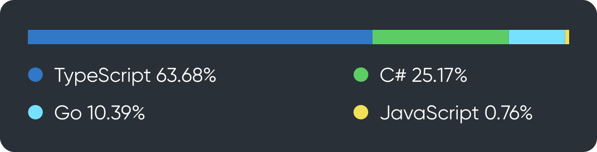

\*langs were updated 20.03.2023

## Flurium

I lead a development team (we can develop site for you). You can checkout our website: [flurium.com](https://flurium.com/)

Or GitHub organisation: [Flurium](https://github.com/flurium).

We created several projects like:
- Online Shop platform Spentoday: [Site](https://github.com/flurium/spentoday), [Shop](https://github.com/flurium/spentoday-shop), [Api](https://github.com/flurium/spentoday-api)
- Agency: [Flurium](https://github.com/flurium/agency)
- Auction platform: [BidMe](https://github.com/flurium/bidme)
- Sales platform: [Thing](https://github.com/flurium/thing)
- Chat with pure networking and hybrid system (centralized and decentralized): [BabbleUp](https://github.com/flurium/babble)

## Personal

- Keyboard layout creation and analyzing tool: [LETA](https://github.com/roman-koshchei/leta)
- Keyboard analyzing API: [Genkey](https://github.com/roman-koshchei/genkey-api)
- C# utils: [Unator](https://github.com/roman-koshchei/unator)
- Dumb React mutable state management: [Mutato](https://github.com/roman-koshchei/mutato) 
